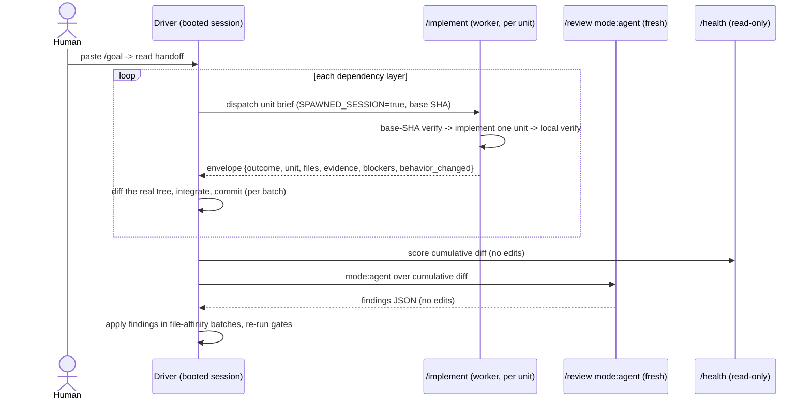

# /implement worker (orchestrate's build atom) - Plan

**Product Contract preservation:** Product Contract unchanged. R1-R8, the Goal Capsule, and the
Strategy record are carried verbatim from the requirements-only version; planning added the
Planning Contract, Implementation Units, Verification Contract, and Definition of Done below.

---

## Goal Capsule

- **Objective:** give gstack a native implement-only worker skill (`/implement`) that the `/orchestrate`
  driver dispatches once per unit, at parity with the `ce-work` atom that makes `orchestrator-handoff`
  bulletproof in production. This is the single unlock: every other tool the orchestration macro calls
  already maps to a shipped gstack skill.
- **Product authority:** this doc; `~/dev/agent-skills/orchestrator-handoff` (the source, run daily and proven);
  `docs/designs/SELF_LEARNING_V0.md` (the R5 "BUILD" atom).
- **Open blockers:** none. The `/review` report-only gap surfaced in research is resolved by U1 (add a
  `mode:agent` to `/review`).

---

## Strategy record (settled - do not re-litigate)

- The orchestration **macro is proven**: `orchestrator-handoff` runs daily and bulletproof. The pattern is
  author-a-handoff, a human boots a fresh top-level **driver** session with the handoff as its `/goal`, and
  the driver dispatches **workers** per unit. The prose driver is battle-tested, so it is **not** a gap.
- Ported to gstack, every tool the macro calls maps to a shipped skill **except the worker**: milestone review
  = `/review` + `/health`, learnings = `/learn` + `/retro` + `learnings.jsonl`, integration = the driver.
- The worker (`ce-work`) has no gstack equivalent, so the worker is the whole unlock. `/orchestrate` (the
  authoring skill) already ships v1 using an Agent-tool-worktree shim; `/implement` replaces that shim with a
  native worker.
- **Worker vs driver** are distinct roles kept separate on purpose (the return-to-caller contract): the driver
  runs the plan and owns the git; the worker does one unit and hands the tree back. `/implement` never crosses
  into driver territory.
- **v1 (this plan):** the proven human-booted-driver surface. **v2 (deferred):** a nested-subagent surface
  (creator -> driver subagent -> worker subagents) that removes the human boot step.

---

## Planning Contract - Key Technical Decisions

- **KTD1 - single-unit leaf.** `/implement` implements exactly one unit; the driver owns dependency layers,
  milestone reviews, learnings, integration, and commits. Matches how `orchestrator-handoff` uses `ce-work`
  and keeps `/orchestrate`'s design intact.
- **KTD2 - gstack-native envelope, no cross-tool parity.** Field names come from gstack's own schemas
  (`timeline` outcome, `/review` evidence and verdict, learnings `files`), not from `ce-work`:
  `outcome` (complete|blocked|failed), `unit`, `plan`, `files`, `evidence` `{observed, checks[], tests}`,
  `blockers`, `behavior_changed`. `standalone_shipping_skipped` is dropped as interop cruft. The worker
  returns an `outcome`; the driver forms the `verdict` on review.
- **KTD3 - host-agnostic worker.** `/implement` implements in whatever workspace it is handed and **never
  runs `git worktree add`**. Isolation is the driver's job (the `ce-work` principle). The driver's seam picks
  the host: Agent-tool `isolation:"worktree"` for v1, `/spec`-style `claude -p` spawn for v2, with no change
  to `/implement`.
- **KTD4 - driver-dispatched, honors `SPAWNED_SESSION`.** `disable-model-invocation: true` (not auto-triggered;
  explicitly dispatchable by the driver's subagent). `/implement` honors the `SPAWNED_SESSION="true"` convention
  (`scripts/resolvers/preamble/generate-spawned-session-check.ts`): no `AskUserQuestion`, auto-choose
  recommendations, skip upgrade/telemetry/routing, end with a completion report.
- **KTD5 - `preamble-tier: 1` + coding guardrails in prose.** The worker does not need the tier-2+ interactive
  machinery (`AskUserQuestion`, context-recovery) or the tier-3 repo-mode "See Something Say Something"
  (contradicts tight scope). `SPAWNED_SESSION` neutralizes interactivity anyway. The one coding guardrail the
  worker needs from the higher tiers (search for an existing helper first) is written directly into the skill.
- **KTD6 - idempotent.** On a re-run, if the unit's deliverables already exist and its verification passes,
  `/implement` verifies-and-reports rather than reimplementing. Supports `/orchestrate`'s stall-salvage
  (principle 11: inspect the tree, do not restart from zero).
- **KTD7 - local verify = unit tests + touched-file typecheck.** The worker runs this unit's own test
  scenarios (red-first proof, then green) and typechecks only the files it changed. The driver re-runs the
  authoritative full gates.
- **KTD8 - add a report-only `mode:agent` to `/review`.** The milestone-review loop needs a review that returns
  structured findings without editing the tree. `/review` is fix-first today (`review/SKILL.md.tmpl:300`), so
  U1 adds a `mode:agent` branch (findings JSON, no edits) while preserving the default fix-first path.
- **KTD9 - base-SHA-verify-first.** Every dispatch opens with `git rev-parse HEAD` vs the brief's pinned base
  SHA and `git reset --hard <base-sha>` if it differs. Mirrors the existing prose in
  `orchestrate/sections/orchestration-semantics.md:34` and global `~/.claude/CLAUDE.md` (the harness can cut an
  isolated worktree from a stale ref).

---

## High-Level Technical Design

The runtime shape v1 targets (human boots the driver; everything below is agent-driven):



Role boundary (the reliability mechanism): the **driver** is root and owns the git; **`/implement`** is a leaf
that returns instead of continuing. `/implement` never commits, reviews, ships, or dispatches.

---

## Output Structure

```text
implement/
  SKILL.md.tmpl        # authored source (this plan's U2)
  SKILL.md             # generated Claude-host output (committed)
```

No `sections/` — the worker is a single focused skill that fits a screen or two (KTD1/KTD5).

---

## Implementation Units

### U1. Add a report-only `mode:agent` to `/review`

- **Goal:** give `/review` a mode that returns structured findings (JSON) without editing the tree, so the
  `/orchestrate` milestone loop can consume findings and apply them in file-affinity batches.
- **Requirements:** enables the driver's milestone-review loop that R8's drop-in seam relies on.
- **Dependencies:** none.
- **Files:** `review/SKILL.md.tmpl`, `review/SKILL.md` (regen); `scripts/resolvers/review.ts` only if the mode
  branch is cleaner as a resolver.
- **Approach:** parse a leading `mode:agent` token (mirror `ce-work`'s `mode:` triage at
  `ce-work/SKILL.md:23`). In `mode:agent`, run the analysis and specialist passes but skip the fix-application
  steps (`review/SKILL.md.tmpl:169-204`) and emit findings as JSON in the existing review-log shape
  (`review/SKILL.md.tmpl:279`: skill/status/issues_found/critical/informational/quality_score/specialists/
  findings/commit). Never `Edit`/`Write` the tree in this mode. The default (no token) stays fix-first.
- **Patterns to follow:** `ce-work/SKILL.md:23` mode-token parse; the existing `gstack-review-log` findings
  JSON shape.
- **Execution note:** characterization-first - capture `/review`'s current fix-first behavior before adding the
  branch, so the default path is provably unchanged.
- **Test scenarios:**
  - `mode:agent` over a small diff returns findings JSON and leaves `git status` clean (no edits). Names the
    input diff and asserts zero tree mutation.
  - Default invocation (no token) still auto-applies AUTO-FIX items (regression: fix-first preserved).
  - `mode:agent` with a critical finding: JSON carries the critical count and specialist entries, tree
    unchanged.
  - Malformed/unknown mode token: report the error, do not silently fall through to fix-mode.
  - Integration: `bun run gen:skill-docs` regenerates `review/SKILL.md` fresh.
  - `Test expectation:` behavior validated by the dogfood run + a manual `git status`-clean check after
    `mode:agent`; per gstack convention there is no per-skill test code, and skill-validation covers frontmatter.
- **Verification:** `/review mode:agent` over a small diff returns findings JSON and leaves the tree unchanged;
  the default path still fixes; `gen:skill-docs --dry-run` clean.

### U2. Author the `/implement` worker skill

- **Goal:** a native implement-only worker that implements one plan unit and locally verifies, returns the
  gstack-native envelope, and never commits, reviews, ships, or sub-dispatches.
- **Requirements:** R1-R8.
- **Dependencies:** none (shares the envelope contract with U3; author first).
- **Files:** `implement/SKILL.md.tmpl`, `implement/SKILL.md` (regen).
- **Approach:** frontmatter - `name: implement`, `preamble-tier: 1`, `version: 0.1.0`,
  `disable-model-invocation: true`, `allowed-tools: [Bash, Read, Write, Edit, Grep, Glob]` (no
  `AskUserQuestion` - `SPAWNED_SESSION` forbids it; no `WebSearch`). Workflow: (1) honor `SPAWNED_SESSION`
  (no questions, auto-choose, completion report); (2) BASE VERIFICATION FIRST (KTD9); (3) read the one-unit
  brief (objective+DoD, files-may-touch, contracts by import path, coding guardrails, boundaries, time-boxes,
  verification+evidence) - work only this unit; (4) idempotency check (KTD6); (5) implement, honoring the
  Execution note (proof-first/characterization for behavior; smoke for config), search for an existing helper
  first, read-source-first, WHY-only comments, no plan-tag refs, halt-and-return on any need to touch a file
  outside the list; (6) local verify (KTD7: unit tests red-first then green + touched-file typecheck; never the
  full suite; never `git worktree add`; never commit); (7) assemble `evidence`; (8) write full detail to
  `/tmp/<slug>-<unit>.md` and return the envelope + conclusion + path; never emit a copyable goal.
- **Patterns to follow:** `ce-work/SKILL.md:363-391` (Return-to-Caller Mode - the implement-only discipline
  and the idempotency re-run rule); `orchestrate/sections/handoff-template.md:100-137` (the received worker
  brief's nine elements); `scripts/resolvers/preamble/generate-spawned-session-check.ts` (`SPAWNED_SESSION`
  behavior); `orchestrate/sections/orchestration-semantics.md:34` (base-SHA prose); `{{SLUG_SETUP}}` ->
  `$SLUG` for the `/tmp` detail filename.
- **Test scenarios:**
  - Behavior-bearing unit: produces the deliverable; `evidence.observed` shows the red-first failure then
    green; `outcome: complete`; `files` lists the changes; `behavior_changed: true`.
  - Non-behavioral unit (config/docs): no test; `evidence` records the deliberate no-test exception + reason;
    `behavior_changed: false`.
  - Base drift: HEAD differs from the brief's base SHA -> resets to base SHA before any work.
  - Idempotency: the unit is already implemented and passing -> verify-and-report, `outcome: complete`, no
    reimplementation, no duplicate edits.
  - Scope overreach: the unit genuinely needs a file outside its list -> `outcome: blocked`, `blockers` names
    the contract question, zero out-of-scope edits.
  - Integration (control boundary): after a run, no worker-authored commit exists and no worktree was created
    by the worker; `git status` in the workspace shows only this unit's files.
  - Integration (`SPAWNED_SESSION`): no `AskUserQuestion` fired; the run ended with a completion report.
  - `Test expectation:` behavior validated by the dogfood run (E2E); skill-validation covers frontmatter/tier;
    no per-skill test code per gstack convention.
- **Verification:** dispatched on a real unit, `/implement` returns a `complete` envelope with red-first
  evidence; the tree carries only that unit's changes; no worker commit or worktree; `gen:skill-docs --dry-run`
  clean.

### U3. Realign `/orchestrate`'s worker seam

- **Goal:** make `/orchestrate`'s sections consistent with the built `/implement`, the new `/review mode:agent`,
  and the gstack-native envelope.
- **Requirements:** R8 (drop-in seam).
- **Dependencies:** U1 (the `/review mode:agent` the loop text names), U2 (the `/implement` contract).
- **Files:** `orchestrate/sections/orchestration-semantics.md.tmpl`, `orchestrate/sections/review-cadence.md.tmpl`,
  `orchestrate/sections/handoff-template.md.tmpl` (+ regen `.md`); `orchestrate/SKILL.md.tmpl` only if it names
  the envelope or seam.
- **Approach:** (a) envelope rename to KTD2 names everywhere they appear (`status`->`outcome`,
  `changed_files`->`files`, `units_attempted`/`units_completed`->`unit`,
  `verification_results`+`verification_evidence`->`evidence{observed, checks[], tests}`,
  `behavior_change`->`behavior_changed`; drop `standalone_shipping_skipped`); (b) retarget the worker seam
  from "Today (the shim)" to "dispatch `/implement` with `SPAWNED_SESSION=true` (the driver picks the host:
  Agent-tool `isolation:"worktree"` for v1)"; realize the "Later (the native atom)" note; (c) fix the milestone
  loop in `review-cadence.md` + `orchestration-semantics.md` to dispatch `/review mode:agent` (findings JSON,
  no edits) as a fresh subagent, driver applies findings in file-affinity batches, `/health` read-only for the
  score; (d) the handoff-template EXECUTION element names `/implement` + `SPAWNED_SESSION`.
- **Patterns to follow:** the existing `orchestrate/sections/*`; U1 and U2 contracts.
- **Test scenarios:**
  - `bun run gen:skill-docs` regenerates `orchestrate/SKILL.md` + sections fresh.
  - Cross-check: the envelope field names in `handoff-template.md` exactly match `/implement`'s returned
    envelope (grep both, assert equal set).
  - Regression: no dangling reference to the old shim as the primary path, the old envelope names, or a
    nonexistent `/review` mode (grep returns none).
  - `Test expectation:` validated by `gen:skill-docs --dry-run` freshness + the grep assertions; no per-skill
    test code.
- **Verification:** `gen:skill-docs --dry-run` clean; grep shows the old envelope names and the "returns
  findings, never edits" fiction are gone and the seam names `/implement` + `mode:agent`.

### U4. Register `/implement` in the doc inventory

- **Goal:** satisfy the enforced doc-inventory tests and surface `/implement` honestly (a driver-dispatched
  worker, not a user command).
- **Requirements:** convention/test-passing (`test/skill-validation.test.ts:1657/1667`).
- **Dependencies:** U2 (the skill must exist).
- **Files:** `AGENTS.md`, `docs/skills.md` (+ regen `scripts/proactive-suggestions.json`, `gstack/llms.txt`).
  No top-level `SKILL.md` router bullet - `/implement` is `disable-model-invocation`, dispatched by
  `/orchestrate`, not user-routed.
- **Approach:** add `/implement` to `AGENTS.md` (Implementation table) and `docs/skills.md` (table row + a short
  factual detail section framing it as the worker `/orchestrate` dispatches). Run `bun run gen:skill-docs`
  (regenerates the catalog).
- **Patterns to follow:** the `/orchestrate` doc-inventory entries already in `AGENTS.md` / `docs/skills.md`.
- **Test scenarios:**
  - The two doc-inventory cross-checks pass: `/implement` matches `/\bimplement\b` in `AGENTS.md` AND
    `docs/skills.md`.
  - Integration: `gen:skill-docs --dry-run` clean after the catalog regenerates.
  - `Test expectation:` the doc-inventory tests are the coverage; no new test code.
- **Verification:** `bun test test/skill-validation.test.ts` passes the two `/implement` doc-inventory tests.

---

## Dependency layers and parallel safety

| Layer | Units | Runs in parallel? | Contention notes |
| ----- | ----- | ----------------- | ---------------- |
| 1 | U1, U2 | yes | disjoint files (`review/` vs `implement/`) |
| 2 | U3, U4 | authoring yes; gen serialized | U3 = `orchestrate/sections/`, U4 = `AGENTS.md`/`docs/skills.md`; both trigger `gen:skill-docs`, which rewrites the shared `scripts/proactive-suggestions.json` + `gstack/llms.txt` - run `gen` once after both, commit together |

---

## Verification Contract

- `bun test` (skill-validation + gen-skill-docs quality) passes, including the two `/implement` doc-inventory
  cross-checks.
- `bun run gen:skill-docs --dry-run` clean (freshness) for `implement/`, `review/`, `orchestrate/`, and the root.
- `bun run skill:check` reports `gstack-implement` OK across hosts.
- **Dogfood (the load-bearing gate):** `/orchestrate` on a small real gstack plan -> a human-booted driver
  dispatches `/implement` per unit (with `SPAWNED_SESSION=true`) -> integrated per-batch commits -> a PR. Assert:
  every worker returns a `complete` envelope with red-first evidence; no worker-authored commit or worktree; the
  milestone `/review mode:agent` returns findings the driver applies; `/health` scores read-only.

---

## Definition of Done

- `/implement` authored: `disable-model-invocation`, `preamble-tier 1`, honors `SPAWNED_SESSION`, base-SHA-verify,
  idempotent, single-unit leaf, verify = unit tests + touched-file typecheck, host-agnostic, returns the
  gstack-native envelope. Committed `.tmpl` + Claude `SKILL.md`.
- `/review` has a working report-only `mode:agent` (findings JSON, no edits); default fix-first preserved.
- `/orchestrate`'s seam realigned (envelope names, `/implement` target, `SPAWNED_SESSION`, `/review mode:agent`
  loop); gen fresh.
- `bun test` + freshness + `skill:check` green; doc inventory green.
- One dogfood run of `/orchestrate` -> `/implement` on a small real plan produces integrated commits + a PR, with
  clean worker envelopes and no worker-authored commits.

---

## Risks & Dependencies

- **`/review mode:agent` blast radius.** U1 touches a core shipped skill. Mitigate: characterization-first (U1
  execution note), preserve the default fix-first path, rely on freshness + the `git status`-clean assertion.
- **The macro is unrun in gstack.** The shim was never executed end-to-end. Mitigate: the dogfood run is a DoD
  gate, not optional - it is the first real execution and the upstream evidence.
- **`SPAWNED_SESSION` wiring.** `/implement`'s correct non-interactive behavior depends on the driver setting
  `SPAWNED_SESSION="true"` at dispatch (U3). Verify in the dogfood.
- **Dispatching a `disable-model-invocation` skill from a subagent.** Confirm the Agent-tool subagent can
  explicitly invoke `/implement` (Skill by name) despite `disable-model-invocation`. Fallback: embed the
  `/implement` instructions in the dispatch brief prose. Resolve at dogfood time.

---

## Scope Boundaries

- **In scope:** U1-U4 above; the v1 human-booted-driver surface.
- **Deferred to Follow-Up Work:** the v2 nested-subagent execution surface (creator -> driver subagent -> worker
  subagents), a headless `claude -p` driver, a Codex/Gemini worker, R4 adaptive ceremony, plan-format
  normalization for non-unit-structured plans.

---

## Outstanding Questions (deferred to implementation)

- The exact host invocation at dogfood time: Agent-tool subagent that runs the `/implement` skill vs a
  `/spec`-style `claude -p` spawn. The envelope/brief contract is transport-independent by design, so this is an
  execution-time choice, not a plan blocker.
- Whether `/review mode:agent` is cleanest as a `SKILL.md.tmpl` branch or a small resolver in
  `scripts/resolvers/review.ts` - decide when touching the file.

---

## Sources & Research

- `ce-work` source (parity contract): `~/.claude/plugins/cache/every-marketplace/compound-engineering/3.19.0/skills/ce-work/SKILL.md`
  - Return-to-Caller Mode + envelope (`:363-391`), mode-token parse (`:23`), worker-dispatch + "isolation is the
    harness's job" (`:164`), idempotency re-run (`:384`).
- gstack fit research (dossier): `/review` is fix-first with no report-only mode (`review/SKILL.md.tmpl:300`);
  `/health` is read-only + scores (`health/SKILL.md.tmpl:35`); `SPAWNED_SESSION` convention
  (`scripts/resolvers/preamble/generate-spawned-session-check.ts`); slug via `{{SLUG_SETUP}}` -> `$SLUG`, no
  `$REMOTE_SLUG`; base-SHA prose (`orchestrate/sections/orchestration-semantics.md:34`); doc-inventory tests
  (`test/skill-validation.test.ts:1657/1667`); the `/orchestrate` worker seam
  (`orchestrate/sections/orchestration-semantics.md:23-58`, `handoff-template.md:100-137`).
- Requirements origin: this file's requirements-only version (Product Contract R1-R8), produced by
  `ce-brainstorm` on 2026-07-17.
